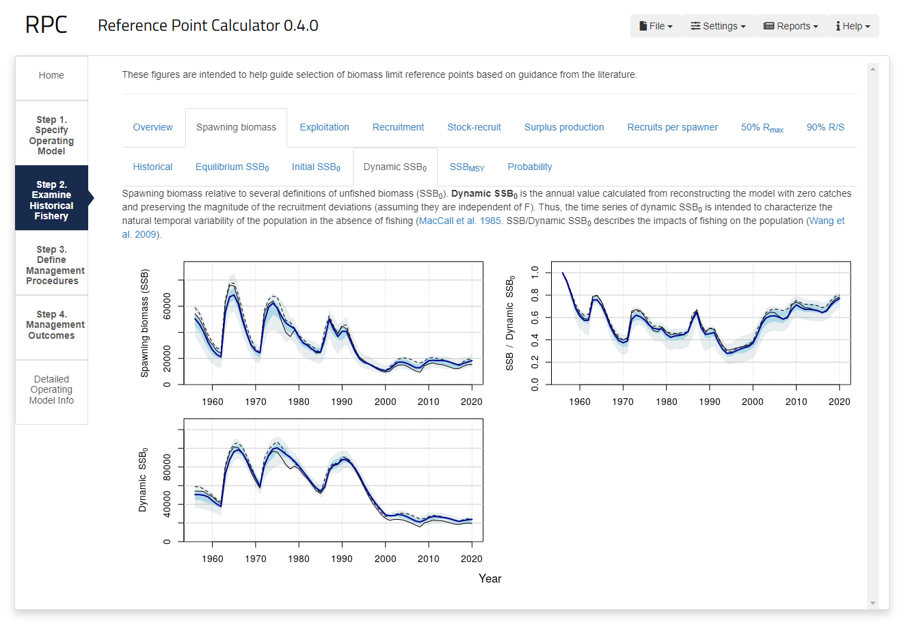

# Summary

`RPC` is a Shiny app that facilitates exploration of candidate limit reference points used for fisheries management of various marine species. The app leverages the computational efficiency of the `openMSE` R software package [@openmse:2021], produces standardized figures, and provides an interactive, graphical user interface for the analysis without the need for backend coding. `RPC` can be used primarily for exploring historical dynamics and LRPs of fish stocks. An optional step to evaluate and recommend management options can also be explored in the app. 

# Statement of need

Contemporary fisheries management focuses on identifying the status of exploited fish stocks relative to a limit reference point (LRP) to inform potential management actions [@caddymahon:1994; @sainsbury:2008; @fsp:2022]. Typically, a stock assessment provides a historical reconstruction of the population and the current status relative to some benchmark is needed. In some management areas, fishery objectives can guide the choice of LRP relative to long-term yield or economic profit. In Canadian fisheries policy, the LRP identifies a threshold to biological serious harm where there is significantly reduced productivity and recruitment. This interpretation of serious harm is consistent with international practice for fisheries management [@sheltonrice:2002], but various metrics pertaining to spawning output (and potentially fishing mortality) can be used as the LRP to meet this definition. Comparative tools would facilitate evaluation of various LRPs and could be used identify whether candidate metrics are appropriate for a given stock. As far as we know, no comprehensive software package is currently available to perform such an analysis.

# Overview

The app is divided into four major steps, each of which is denoted by a side tab in the app (\autoref{fig:screenshot}).

In Step 1, users select an operating model that most closely resembles their population of interest. The app provides three options: (1) selecting a pre-loaded operating model of various Canadian and international fish stocks, (2) uploading a `*.rds` file containing an operating model compatible with `openMSE`, or (3) completing the `MERA` qualitative questionnaire which is converted a quantitative population dynamics model [@mera:2023].

Step 2 generates figures to explore the population status with time series and phase plots of the stock trajectory over time relative to various LRPs. With stochastic operating models, the probability that the stock has exceeded candidate LRPs is reported. While the app cannot provide a recommendation for any individual operating model, supporting text provides a summary description of the derivation and assumptions behind each candidate LRP. When necessary, diagnostic plots are provided to determine if the past trajectory of the stock has met the assumptions of historical-based LRPs to inform users of any potential limitations.

Step 2 addresses an immediate technical need to identify a potential LRP, while Steps 3 and 4 support a broader analysis to identify management options that promote fisheries sustainability [@marentette:2021]. Step 3 provides the opportunity to explore various management options, including management procedures that use fixed catch scenarios, fixed effort (fishing mortality rate) scenarios, harvest strategies based on the true or estimated population status, or empirically-based management procedures from the `DLMtool` package [@dlmtool:2018]. These management procedures are then applied in projections with closed-loop simulation.

Step 4 returns the results from the projections in Step 3. Projected outcomes of the operating model are reported here, and panels provide users the opportunity to create performance measures to calculate the probability that some quantity, such as catch, or biomass relative to a candidate LRP, exceeds a specified threshold during the projection. Such performance measures can evaluate: (1) whether candidate LRPs are sensible under some reference projections, for example, with no fishing, or (2) the scope of management options, i.e., catch levels, needed to ensure the stock remains above the LRP with high probability.

A summary fifth panel provides additional information on stock dynamics that are not covered in the panel for Step 2. This panel also provides further options for altering the assumptions of the stock dynamics in the projection period. These feature are intended for modeling hypothesized time-varying productivity scenarios (induced by climate change or other natural environmental factors).

# Usage

The source code for `RPC` is stored on [Github](https://github.com/Blue-Matter/RPC). The app is hosted in the eponymous R package which can be downloaded and run on a local computer. Alternatively, the app can be directly accessed at [https://apps.bluematterscience.com/RPC](https://apps.bluematterscience.com/RPC).

Work in progress can be saved to file and returned to later by uploading the session file to the app. We envision some users will need additional flexibility in their analyses and require backend coding in R, for example, for detailed operating model setup and/or final analyses to develop recommendations for management. For such purposes, the core suite of R functions used in the Shiny app are available from the R package.

While `RPC` focuses on Canadian case studies, several LRP methods in the app are used in other management jurisdictions, e.g. @ICES:2021. Therefore, this app will be of interest for a global audience for fisheries population modeling.

# Figures

# Acknowledgements

We acknowledge funding from the Sustainable Fisheries Science Fund from the Government of Canada. Feedback from test users in the Department of Fisheries and Oceans (DFO) working group guided the functionality and the layout of the app.

# References

