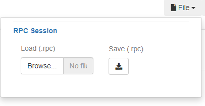
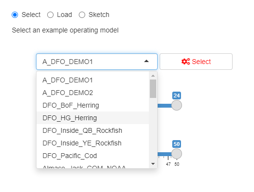
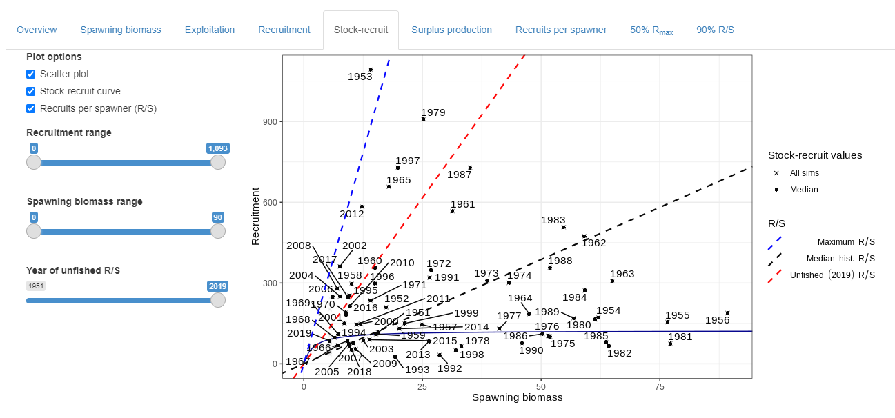
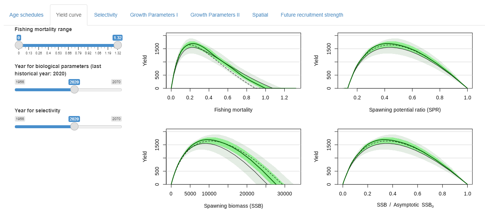
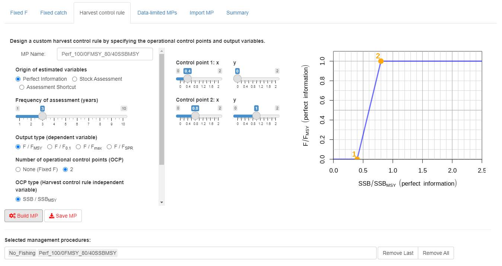
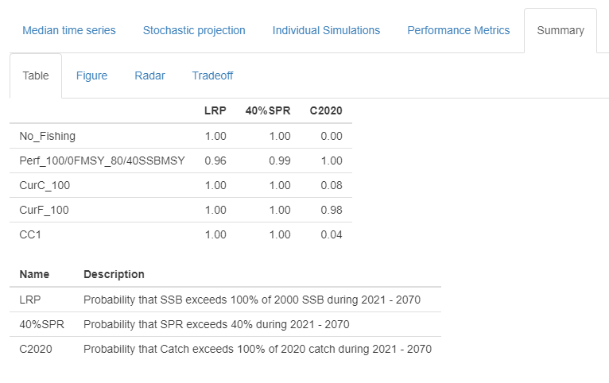

<style type="text/css">


h3.subtitle {
  font-size: 26px;
}

h4{ /* Normal  */
   font-size: 13px;
}
body{ /* Normal  */
   font-size: 12px;
}
td {  /* Table  */
   font-size: 8px;
}
h1 { /* Header 1 */
 font-size: 18px;
 color:  #00783A;
}
h2 { /* Header 2 */
 font-size: 15px;
 color: #00783A;
}
h3 { /* Header 3 */
 font-size: 15px;
 color: #00783A;
}
code.r{ /* Code block */
  font-size: 10px;
}
pre { /* Code block */
  font-size: 10px
}
</style>


```{r set options, echo = FALSE}
knitr::opts_chunk$set(collapse = TRUE, comment = "#>")
knitr::opts_chunk$set(dpi=85)
options(width = 650)
#library(RPC)
```

# Introduction

## About Reference Point Calculator 

The Reference Point Calculator (RPC) is an interactive online app for exploring and deriving limit and target reference points for Canadian fisheries. Use of the RPC falls into two general categories. First, RPC is intended to visualize the stock dynamics, including those arising from environmental conditions experienced by the stock, needed to meet the Fish Stocks Provisions of the Fisheries Act, specifically the establishment of limit reference points (LRPs). Second, management strategies can then be evaluated against performance measures related to the LRP and other outcomes of interest using closed-loop simulation.

Information about operating model conditioning, such as the reliability of estimates from a model, is currently beyond the scope of the App and is not presented here.

This document:

* Explains how to access and use the RPC App
* Describes the requirements for developing an operating model to incorporate into RPC
* Describes RPC outputs used to explore the historical dynamics and examine potential limit reference points
* Develop management procedures (MPs) to test in closed-loop simulation
* Develop performance metrics to evaluate and visualize MP performance

## Quick Start

For a demonstration of the RPC, go to the [online app](https://apps.bluematterscience.com/RPC/). RPC is under active development with a separate [RPCdev](https://apps.bluematterscience.com/RPCdev/) website that hosts new features as they are added and tested.

Alternatively, the RPC can be run on a local computer in R:

```{r eval = FALSE}
devtools::install_github("Blue-Matter/RPC")
RPC::RPC()
```

Previous session of the RPC can be resumed by uploading a saved session (as an .rpc file) in the upper right corner. It is recommended to frequently save your work as some of the computations are time-intensive. Using the 'Back' or 'Forward' buttons on your web browser can also end the RPC session.



# Specify Operating Model

The first step for using RPC is to load an operating model (OM), which will represent the biological and fleet dynamics of the stock as well as control the attributes of simulated data and implementation error. OMs will need to be compatible with the openMSE system, i.e., developed for the [MSEtool](https://msetool.openmse.com/) R package.

Alternative hypotheses about biological dynamics, including those in the future, will need to be incorporated in separate OMs.

OMs can be loaded in three ways:

## Select a pre-loaded OM

RPC comes with a suite of pre-built OMs, including a variety of Canadian stocks, which can be selected from the dropdown menu.



## Load an OM

Users can upload an operating model (saved using the `saveRDS` R function) developed outside of RPC into the App. OMs can be developed in several ways in openMSE, including:

* [Importing an assessment](https://openmse.com/om-data-rich/), including Stock Synthesis 3 and iSCAM. The `VPA2OM` function in MSEtool allows one to specify an OM using arrays of abundance-at-age, mortality-at-age, and biological parameters.
* [Conditioning an OM from data](https://openmse.com/tutorial-rcm/) using the RCM (Rapid Conditioning Model)
* [Developing an OM from scratch](https://openmse.com/object-operating-model/)

## Sketching an OM

As an extension of developing an OM from scratch, RPC imports the [MERA App](https://www.merafish.org/) to develop OMs from a mandatory questionnaire and an optional dataset. For more information, see the [MERA User Guide](https://dlmtool.github.io/DLMtool/MERA/MERA_User_Guide_v6.html)

# Examine Historical Fishery

The historical dynamics will be re-constructed once the OM is selected. This panel explores methods explored the scientific literature for setting reference points (either a limit or a target) from various management settings around the world. These method tend to fall into one (or more) of several categories:

* **Historical biomass methods** use a biomass value from some year in the past as the reference point
* **MSY-based methods** use the yield curve is used as the basis for setting reference points 
* **Stock-recruit methods** use patterns in historical stock-recruit values as the basis of a reference point 
* **Exploitation-based methods** are used for establishing fishing mortality based reference points (instead of biomass)

Generally there does not appear to be a single method that can be used in all situations. Some methods may have assumptions, e.g., a specific historical fishing history or recruitment pattern, or stationarity in stock dynamics, that may not be applicable for the operating model at hand. 

Diagnostic figures generated here apply these methods for the operating model. For each candidate reference point method, the annual probability that the stock has historically exceeded such thresholds can be calculated and presented. 



## Detailed Operating Model Information

Additional figures are available to explore the specification of the operating model, **for both historical and projection years**, including:

* **Biological schedules** that plot maturity, length, weight, natural mortality at age and at year
* **Fleet selectivity at age**
* **Yield curve dynamics** arising from the combination of the preceding biological and fleet parameters
* **Future recruitment strength relative to historical**. This can be used to explore an operating model that focuses on future recruitment scenarios, e.g., poor recruitment or specific recruitment pulses.



# Define Management Procedures

After exploring the operating model, MPs can be developed and tested in closed-loop simulation using the future dynamics specified in the operating model. This panel provides the ability to configure several types of MPs and add them to the list of those to be tested. Ideally it is best practice to compare status quo approaches along with candidate MPs.

Except for fixed MPs, the frequency of how often the advice is updated by the MP is also specified.

Currently, several types of MPs can be created in the App:

## Fixed MP approaches

Two types of fixed MPs can be specified here. Fixed F (fishing mortality) MPs set the F to a percentage of that in the terminal year for the duration of the OM projection period, while fixed catch MPs set the catch recommendation to a proportion of the terminal year catch. 

The `No_Fishing` MP, which sets F = 0, is always a selected MP and serves as a useful reference to understand the future dynamics of the operating model. 

## Harvest control rules

Here, the user can design a harvest control rule (HCR) that will set the catch recommendation using estimates related to the operating model, e.g., biomass estimates. 

First, the source of the estimates is specified:

* **Perfect** means that the estimates will be grabbed directly from the operating model. This can be useful for comparing harvest control rules without considering the error associated with obtaining those estimates.
* **Stock assessment** fits a [statistical catch-at-age model](https://samtool.openmse.com/reference/SCA.html) to catch, index, and age composition data generated by the operating model. The data are in the format of a class [Data](https://openmse.com/object-data/) object. Stationary biological and selectivity parameters are assumed in the model. This option most closely resembles the real process of providing catch advice and captures the error associated with model fitting and potential model misspecification. It is also the most time-consuming option to run the closed-loop simulation.
* **Shortcut** is a variant of the assessment approach that attempts to approximate the model fitting process (and capture the inherent error). (see [Wiedenmann et al. 2015](https://doi.org/10.1016/j.fishres.2015.07.037) for an introduction to this type of approach). At the beginning of the closed-loop simulation, the stock assessment model is fitted to the historical data, and the error in biomass and abundance estimates is quantified using a [vector autoregressive model](https://samtool.openmse.com/reference/Shortcut.html) on the residuals between the estimated values and the true values in the operating model. Subsequently in the closed-loop simulation, the estimates for the harvest control rule are generated by sampling the operating model values with error from the autoregressive model.

Second, the type of the output variable is specified. This will be some proportion of fishing mortality relative to either MSY, yield per recruit (F<sub>0.1</sub> or F<sub>max</sub>), or spawning potential ratio. The advice is the catch recommendation associated with fishing at the output variable. Currently, no projections are run and the catch recommendation is constant year over year until the HCR is updated.

Third, the type of harvest control rule is set. Currently, there is an option for zero operational control points (OCPs), i.e., catch is calculated from some fixed proportion of the output variable, or two OCPs using a ramped HCR. If OCPs are used, then the type of OCP, choosing from either biomass relative to MSY or unfished quantity or fishing mortality relative to MSY, yield per recruit or spawning potential ratio, along with the shape of the HCR is specified.

Finally, users specify the frequency of how often the MP (the estimation method and the HCR application) is updated. 

The value of the output variable and operational control points is obtained from the same source as the estimates.



## Data-limited MPs

MPs developed for consideration in data-limited contexts, e.g., empirical MPs, can also be added. The App displays the suite of MPs in the [DLMtool](https://dlmtool.openmse.com) package along with the description. Most of these MPs return catch-based advice, and there are also effort-based and size-limited based MPs.

## Upload an MP

Users can also upload an MP that was coded outside of the App and saved using the `saveRDS` function. Information on writing custom MPs is available on the [openMSE](https://openmse.com/features-management-procedures/custommps/) website. 

# Management Outcomes

Upon running the closed-loop simulations, outcomes related to biomass, fishing mortality, and catch are provided. Figures can summarize trajectories for individual MPs, compare outcomes of individual simulations for each MP.

Users can define performance metrics (PMs) to compare MP performance. PMs for limit and target reference points can be defined relative to historical biomass, unfished biomass, or MSY values. Additional PMs can be generated for catch and fishing mortality objectives. PMs are defined by the threshold and the range of years in the projection period, with the resulting probability that the operating model has exceeded such thresholds over the time period. Once a suite of PMs are generated, summary plots (spider/radar plots, tradeoff plots, etc.) allow comparison of the tested MPs.



# Appendix

## Management Strategy Evaluation

Management Strategy Evaluation (MSE) is an approach for establishing simple rules for managing a resource and then simulation testing their robustness to various hypothetical scenarios for system dynamics (Butterworth and Punt 1999; Cochrane et al. 1998). 

Often referred to as Management Procedures (MPs, aka Harvest Strategies) these rules typically use streamlined data to generate management advice such as a Total Allowable Catch (TAC). 

In fisheries, MSE differs substantially from conventional stock assessment in how models of fisheries dynamics are used to derive management advice. In conventional stock assessment, fisheries dynamics models are used to directly derive management advice. For example, setting a TAC commensurate with fishing mortality rate at maximum sustainable yield. MSEs typically use a greater number of fitted fisheries dynamics models (‘operating models’) that span a much wider range of uncertainties in order to test the robustness of MPs. The focus in MSE is robustness accounting for feedbacks between management options and the system rather than establishing a single 'best' model of the resource. 

Consequently, MSE allows managers and stakeholders to establish a comparatively simple management rule (an MP), understand its performance and have confidence that it can perform adequately even in the face of uncertainties in system dynamics.

Punt et al. (2014) provide a comprehensive summary of the history of MSE implementations. 

## References

Butterworth, D.S., Punt, A.E. 1999 Experiences in the evaluation and implementation of management procedures. ICES Journal of Marine Science, 5: 985-998, http://dx.doi.org/10.1006/jmsc.1999.0532.

Cochrane, K L., Butterworth, D.S., De Oliveira, J.A.A., Roel, B.A., 1998. Management procedures in a fishery based on highly variable stocks and with conflicting objectives: experiences in the South African pelagic fishery. Rev. Fish. Biol. Fisher. 8, 177-214.

Punt, A.E., Butterworth, D.S., de Moor, C.L., De Oliveira, J.A.A., Haddon, M. 2014. Management strategy evaluation: best practices. Fish and Fisheries. 17(2): 303:334. https://doi.org/10.1111/faf.12104 


# Acknowledgements

RPC development was funded by Fisheries and Oceans Canada. Many thanks to the testing team for their feedback and suggestions.

The RPC App, manuals and example OM objects were coded by Blue Matter Science Ltd. 


